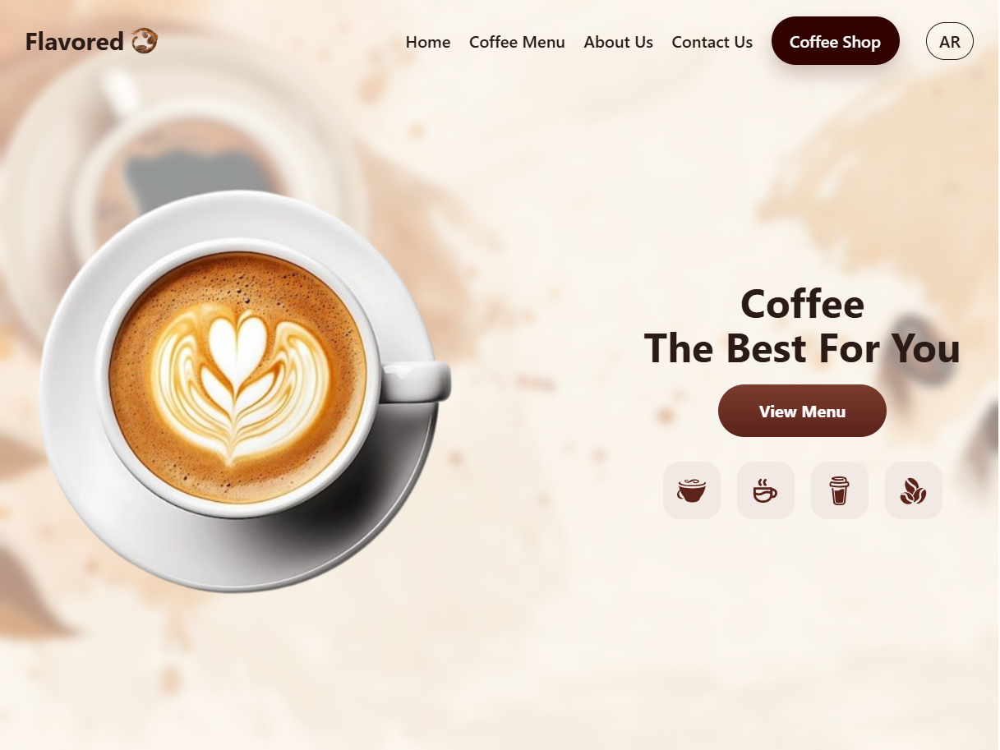

# Coffee Landing Page

## Overview

A **React + Tailwind CSS** single-page coffee website with bilingual support (English/Arabic) using `react-i18next`.  
It features smooth in-page navigation, organized sections, and a professional **curtain-style mobile menu animation** built via a separate CSS file.

## 🖼️ Preview

<p align="center">
  
</p>

## Features

- 🎯 Organized sections: `Hero`, `Menu`, `About`, `Contact`
- 🌐 Multi-language (English/Arabic) via `react-i18next`
- 📱 Responsive design with **curtain (scaleY) animation** for the mobile navigation menu
- 🧭 Smooth scrolling navigation
- 🎨 TailwindCSS with custom styles for flexibility and easy customization
- 🖼 Structured assets directory for images and icons
- ♿ Accessibility-friendly and respects `prefers-reduced-motion`

## Requirements

- Node.js 18+
- npm / yarn / pnpm

## Getting Started

```bash
# Install dependencies
npm install
# or
yarn
# or
pnpm install

# Run the development server
npm run dev
# or
yarn dev
# or
pnpm dev

# Build for production
npm run build

# Preview production build (optional)
npm run preview
```

## Project Structure

```
src/
  assets/                  # Images and visual assets
  components/
    About.jsx
    Contact.jsx
    Hero.jsx
    Menu.jsx
    Navbar.jsx
  locales/
    ar.json
    en.json
  styles/
    global.css             # Tailwind + global variables
    navbar-curtain.css     # Curtain animation for mobile menu
  App.jsx
  i18n.js
  main.jsx
```

## Internationalization (i18n)

Language detection order:

1. URL parameter `?lang=ar|en`
2. `localStorage.language`
3. Default: `en`

### Adding a New Language

1. Create a file like `fr.json` inside `src/locales/`
2. Register it in `resources` within `i18n.js`
3. Use `?lang=fr` or store `"fr"` in `localStorage.language`

## Styling

- **TailwindCSS** is enabled via `global.css`:
  ```css
  @tailwind base;
  @tailwind components;
  @tailwind utilities;
  ```
- Global variables (like `--text` and `--maxw`) are defined in `:root` in `global.css`.
- The **curtain menu animation** is implemented in `styles/navbar-curtain.css` using:
  - `className="curtain-nav"` on the `<nav>` element
  - `data-open={menuOpen}` to control open/close state

### Curtain Menu Behavior

- On mobile: smooth curtain-style drop-down (scaleY) animation.
- On desktop: completely disabled via media queries.
- Fully respects `prefers-reduced-motion` for accessibility.

## Main Components

- **Navbar.jsx** → Navigation links, language toggle, curtain animation
- **Hero.jsx** → Main headline, call-to-action button, icons
- **Menu.jsx** → Coffee drink cards and descriptions
- **About.jsx** → Application info and store buttons
- **Contact.jsx** → Contact details and links

## Best Practices

- Use semantic `<section id="...">` elements for clean navigation.
- Update color schemes and gradients easily from `navbar-curtain.css`.
- Add `IntersectionObserver` later to highlight the active section while scrolling.

## Deployment

```bash
npm run build
# Deploy the dist/ folder to any static hosting provider (Netlify, Vercel, GitHub Pages, etc.)
```

## License

MIT © 2025
